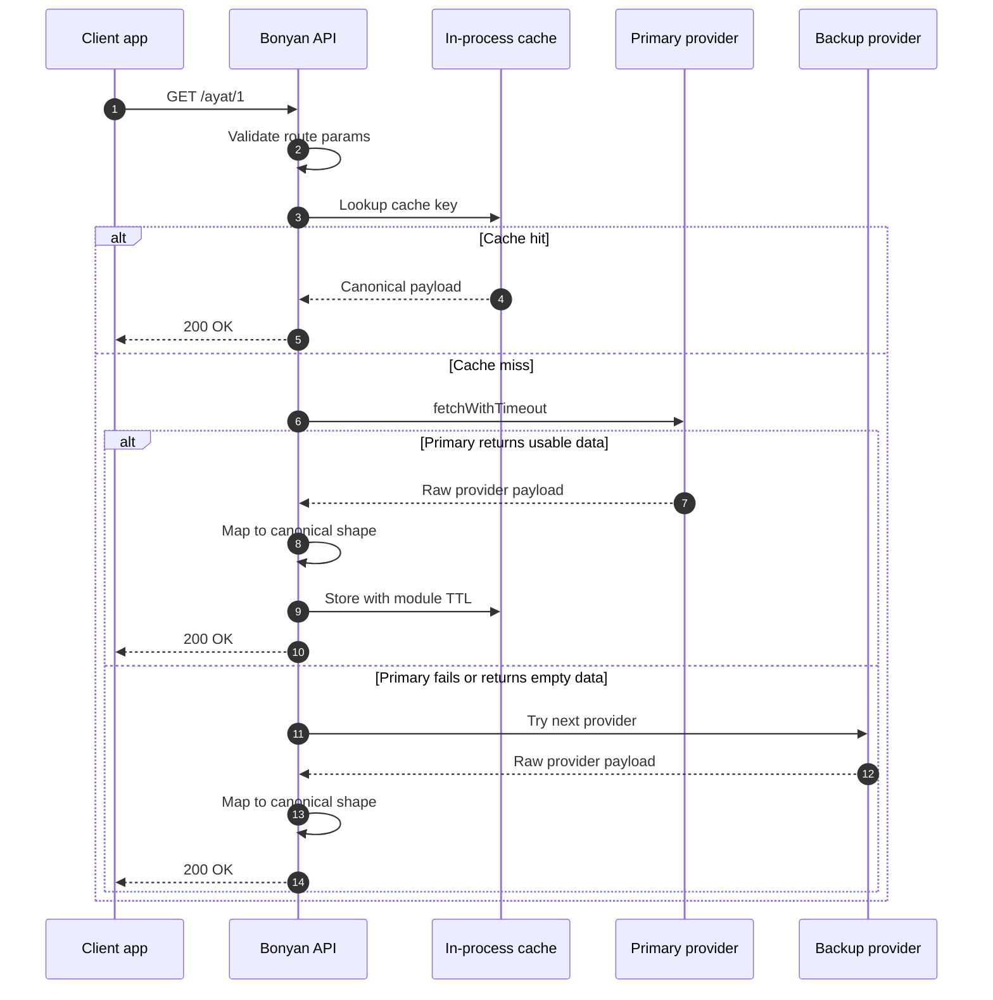

**Bonyan API** is the first major API surface under BonyanOSS. It is a
Fastify + TypeScript service that gives developers one clean interface for
Islamic content and utilities: Quran text, surah metadata, reciters, tafsir,
azkar, hadith, prayer times, Hijri conversion, and Qibla direction.

The project is intentionally simple: one module per domain, one controller per
route group, one service layer per upstream chain, and one stable JSON contract
for clients.

## Surfaces

| Surface | URL | Role |
| --- | --- | --- |
| Hosted API | `api.bonyanoss.org/bpnyan-api/v1` | Public versioned API gateway path. |
| Docs | `docs.bonyanoss.org/bonyan-api` | Guides, concepts, examples, and reference. |
| Source code | `github.com/BonyanOSS/Bonyan-API` | MIT-licensed Fastify + TypeScript implementation. |
| Status | `status.bonyanoss.org` | Availability for public BonyanOSS services. |

## What It Provides

<CardGroup cols={3}>
  <Card title="Quran data" icon="book-quran" href="/reference">
    Fetch all ayat, single ayat, surah/ayah lookups, normalized Arabic search,
    and the 114-surah index.
  </Card>
  <Card title="Recitation audio" icon="microphone" href="/reference">
    List reciters, inspect available moshafs, search by Arabic name, and resolve
    MP3 URLs.
  </Card>
  <Card title="Tafsir" icon="scroll" href="/reference">
    Read supported Arabic tafsir editions by full surah or individual aya.
  </Card>
  <Card title="Azkar" icon="sparkles" href="/reference">
    Serve supplication categories, category items, random azkar, and normalized
    Arabic search.
  </Card>
  <Card title="Hadith" icon="book-open" href="/reference">
    List books, request ranges, fetch a single hadith by number, or request a
    random hadith.
  </Card>
  <Card title="Daily utilities" icon="compass" href="/reference">
    Prayer times, Hijri date conversion, today's Hijri date, and Qibla bearing.
  </Card>
</CardGroup>

## Implementation Shape

| Layer | What the code does |
| --- | --- |
| Server | Creates the Fastify app, enables CORS, applies `@fastify/rate-limit`, registers modules, and exposes `/` plus `/health`. |
| Routes | Each module owns its route file, such as `surah.route.ts`, `ayat.route.ts`, and `qibla.route.ts`. |
| Controllers | Validate path/query parameters, return `400`/`404` for client mistakes, and call service functions. |
| Services | Fetch upstream providers, map their raw payloads into BonyanOSS types, cache results, and run fallback chains. |
| Utilities | Shared helpers cover response envelopes, Arabic normalization, timeout-aware fetch, fallback, and in-process caching. |

## Reliability Model



The service never asks clients to understand upstream formats. A surah item,
ayah item, hadith item, or Qibla result keeps the same shape regardless of
which provider answered behind the scenes.

## Response Contract

Most endpoints return one of these two shapes:

```json Success
{ "success": true, "data": { "endpoint": "specific payload" } }
```

```json Failure
{ "success": false, "message": "human-readable error" }
```

Search endpoints such as `/ayat/search` and `/azkar/search` add a top-level
`total` field:

```json Search success
{ "success": true, "total": 12, "data": [] }
```

`GET /` and `GET /health` are intentionally small service endpoints and do not
use the standard success envelope.

## Module Map

| Module | Routes |
| --- | --- |
| Meta | `GET /`, `GET /health` |
| Surah | `GET /surah`, `GET /surah/:id`, `GET /surah/search` |
| Ayat | `GET /ayat`, `GET /ayat/:id`, `GET /ayat/:surah/aya/:id`, `GET /ayat/search` |
| Reciters | `GET /reciters`, `GET /reciters/:id`, `GET /reciters/search`, `GET /reciters/:id/surah/:surah` |
| Tafsir | `GET /tafsir`, `GET /tafsir/:edition/:surah`, `GET /tafsir/:edition/:surah/:aya` |
| Azkar | `GET /azkar`, `GET /azkar/:category`, `GET /azkar/random`, `GET /azkar/search` |
| Hadith | `GET /hadith`, `GET /hadith/random`, `GET /hadith/:book`, `GET /hadith/:book/:number` |
| Prayer | `GET /prayer/times` |
| Hijri | `GET /hijri/today`, `GET /hijri/from-gregorian`, `GET /hijri/to-gregorian` |
| Qibla | `GET /qibla` |

## Source Chains

| Module | Primary | Fallback |
| --- | --- | --- |
| Surah | `mp3quran.net` | `alquran.cloud`, then `quran.com` |
| Ayat | `alquran.cloud` Uthmani Quran | jsDelivr mirror of `fawazahmed0/quran-api` |
| Reciters | `mp3quran.net` | `quran.com` recitations |
| Tafsir | Edition-specific `alquran.cloud` or `quranenc.com` | The other provider when the edition exists there |
| Azkar | Pinned `nawafalqari/azkar-api` JSON | `hisnmuslim.com` |
| Hadith | `api.hadith.gading.dev` | jsDelivr mirror of `sutanlab/hadith-api` |
| Prayer | `api.aladhan.com` | `api.pray.zone` for coordinate requests |
| Hijri | `api.aladhan.com` | No second source |
| Qibla | `api.aladhan.com` | Local great-circle calculation |

## Where To Go Next

<CardGroup cols={3}>
  <Card title="Quickstart" icon="rocket" href="/quickstart">
    Make the first request and understand the response envelope.
  </Card>
  <Card title="Fallback model" icon="shield-halved" href="/concepts/fallback">
    See how upstream timeout, empty payload, and fallback behavior works.
  </Card>
  <Card title="API reference" icon="code" href="/reference">
    Browse every endpoint, parameter, response shape, and example.
  </Card>
</CardGroup>
