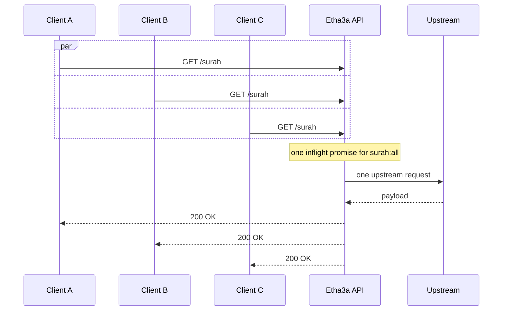

Etha3a API uses a small in-process cache in `utils/cache.ts`. It is a `Map`
with per-key expiry plus an `inflight` map that coalesces concurrent identical
loads.

There is no Redis layer in the current project. That is intentional for this
stage: most content is public, read-heavy, and slow-changing, so a local
memoized service layer keeps the implementation easy to understand and easy to
self-host.

## TTL By Data Set

| Data | Cache key pattern | TTL |
| --- | --- | --- |
| Surah list and surah search | `surah:all` | 12 hours |
| Full Quran corpus, ayah lookup, ayah search | `ayat:full` | 24 hours |
| Reciters, reciter search, audio URL lookup | `reciters:all` | 1 hour |
| Tafsir by edition/surah/aya | `tafsir:{edition}:{surah}:{aya-or-all}` | 24 hours |
| Azkar categories, category lookup, search, random source pool | `azkar:all` | 24 hours |
| Hadith book list | `hadith:books` | 24 hours |
| Hadith book ranges and single hadith lookup | `hadith:book:{book}:{from}-{to}` | 12 hours |
| Prayer times | `prayer:{date}:{lat}:{lng}:{city}:{country}:{method}` | 1 hour |
| Hijri conversions | `hijri:g2h:{date}`, `hijri:h2g:{date}` | 7 days |
| Qibla direction | `qibla:{lat.toFixed(4)}:{lng.toFixed(4)}` | 30 days |

`/azkar/random` still returns a fresh random item on every request. What is
cached is the source corpus it selects from.

## Concurrent-call Coalescing

If three clients trigger the same cold key at the same time, Etha3a API runs
the loader once and lets every caller await the same promise.

This is the part that protects upstream providers during cold starts and
traffic bursts.

## What Is Cached

The services cache normalized internal data, not raw upstream responses. For
example, `getAyatContent()` caches the full Quran corpus as
`SurahWithAyaItem[]`; individual ayah lookups and text search then scan that
cached corpus in-process.

Failures are not cached. If a provider chain fails and returns `503`, the next
request tries the provider chain again.

## When To Add Redis

Add a shared cache only when you actually run multiple replicas and need cache
state shared between them. The replacement point is deliberately narrow:
replace the implementation behind `memoize`, `invalidate`, and `clearCache`
while keeping service code unchanged.
