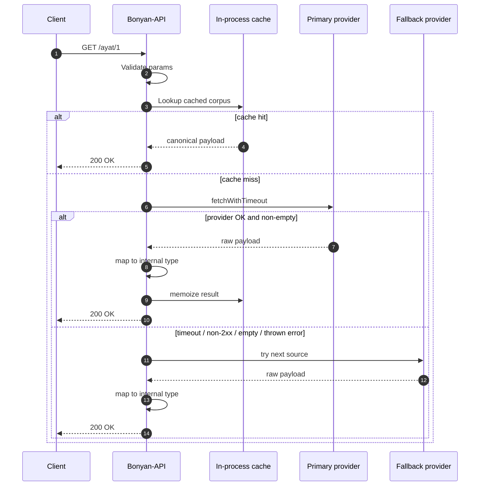

Bonyan-API depends on public upstream providers, and public upstream providers
sometimes fail. The API handles that by trying an ordered source chain inside
the service layer, then returning the same canonical BonyanOSS shape to the
client no matter which provider answered.

The important idea is simple: **clients integrate with Bonyan-API, not with every
upstream provider.**

## Request Lifecycle



## What Counts As Failure

Fallback is triggered when a provider request throws, times out, returns a
non-2xx response, or maps to an empty result. The shared `fetchWithTimeout`
utility defaults to **8 seconds**, and individual services raise that where the
payload is larger:

| Area | Timeout examples |
| --- | --- |
| Hijri and Qibla | 8 seconds |
| Hadith books and prayer times | 10 seconds |
| Tafsir surah, azkar, hadith ranges | 12-15 seconds |
| Full Quran text | 20 seconds |

Some modules use the shared `runWithFallback` helper. Others keep a local
fallback loop because their result shape is slightly different, but the
behavior is the same: try providers in order, accept the first usable result,
and surface `503` only when no usable result can be produced.

## Source Chains

| Module | Primary | Fallback |
| --- | --- | --- |
| `/surah` | `mp3quran.net` | `alquran.cloud`, then `quran.com` |
| `/ayat` | `alquran.cloud` Uthmani Quran | jsDelivr mirror of `fawazahmed0/quran-api` |
| `/reciters` | `mp3quran.net` | `quran.com` recitations |
| `/tafsir` | Edition-specific `alquran.cloud` or `quranenc.com` | The other provider when supported |
| `/azkar` | Pinned `nawafalqari/azkar-api` JSON | `hisnmuslim.com` |
| `/hadith` | `api.hadith.gading.dev` | jsDelivr mirror of `sutanlab/hadith-api` |
| `/prayer/times` | `api.aladhan.com` | `api.pray.zone` for coordinate requests |
| `/hijri/*` | `api.aladhan.com` | No second source |
| `/qibla` | `api.aladhan.com` | Local great-circle calculation |

<Note>
  `GET /qibla` is special. With valid coordinates, it can still return a result
  when Aladhan is unavailable because the service computes the bearing locally.
</Note>

## Canonical Shapes

The whole point of fallback is that the client does not care which provider
answered. For example, every surah provider is mapped into this shape:

```ts
type SurahItem = {
  id: number;
  name: string;
  makkia?: boolean;
  apiName: "mp3quran.net" | "alquran.cloud" | "quran.com";
};
```

`apiName` is useful for logs and debugging. It should not become branching
logic in client code.

## Self-hosting Notes

If you fork or self-host Bonyan API, provider priority lives in each module's
service file. For example, the surah chain is defined in `surah.service.ts`,
and the ayat chain is defined in `ayat.service.ts`. Reorder providers only when
you are intentionally changing the service's reliability behavior.

<AccordionGroup>
  <Accordion title="Does fallback retry upstream 429 responses?">
    Yes. A non-2xx upstream response is treated as a failed provider attempt,
    so the next source is tried. A 429 returned to your client is Bonyan API's
    own rate limit.
  </Accordion>
  <Accordion title="Can I force one provider from the public API?">
    No. The public contract is provider-agnostic. If you self-host, you can edit
    the module service and register only the provider you want.
  </Accordion>
  <Accordion title="Why do some modules have no external fallback?">
    A fallback is only useful when it is trustworthy. Hijri conversion currently
    uses Aladhan only because date calibration can vary by convention and
    region.
  </Accordion>
</AccordionGroup>
