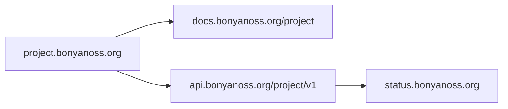

BonyanOSS should feel organized from the first URL. The domain structure below
keeps the public site, docs, APIs, status page, and project-specific surfaces
easy to understand.

| Surface | Proposed URL | Purpose |
| --- | --- | --- |
| Main site | `bonyanoss.org` | Public organization home, mission, projects, contributors, and calls to action. |
| Docs for all projects | `docs.bonyanoss.org` | Central documentation hub for every BonyanOSS project. |
| Status page | `status.bonyanoss.org` | Uptime, incidents, maintenance windows, and reliability communication. |
| Unified API | `api.bonyanoss.org` | Shared API gateway for BonyanOSS services. |
| Etha3a API | `api.bonyanoss.org/etha3a/v1` | Versioned Islamic content API under the unified API gateway. |
| Etha3a docs | `docs.bonyanoss.org/etha3a` | Etha3a guides, concepts, examples, and API reference. |

## Why This Structure Works

<CardGroup cols={2}>
  <Card title="Easy to remember" icon="route">
    Users and developers can guess where to go: docs for docs, api for APIs,
    status for reliability, and project subdomains for product surfaces.
  </Card>
  <Card title="Ready for many projects" icon="layer-group">
    Future projects can follow the same pattern, such as
    `quran.bonyanoss.org`, `hadith.bonyanoss.org`, and
    `api.bonyanoss.org/hadith/v1`.
  </Card>
  <Card title="Clear API versioning" icon="code-branch">
    Versioned API paths allow breaking changes to be introduced responsibly
    without surprising existing clients.
  </Card>
  <Card title="Professional operations" icon="signal">
    A dedicated status page gives companies, contributors, and users a trusted
    place to check availability.
  </Card>
</CardGroup>

## Future Project Pattern

<Note>
  Keep project URLs short, descriptive, and stable. If a public URL changes,
  add a redirect and document the change in the relevant project docs.
</Note>
