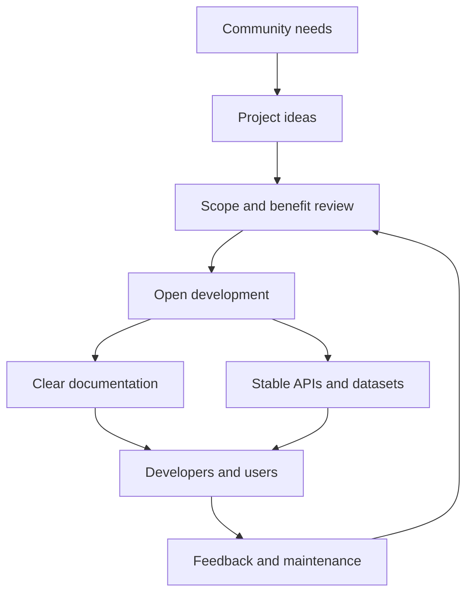

BonyanOSS is not just a collection of separate repositories. It is intended to
grow into a shared ecosystem for Islamic and community-focused software: web
apps, APIs, datasets, libraries, documentation, and operational tooling that
can reinforce each other over time.

## The Core Idea

> Build what benefits people, keep it open, and make it easier for others to continue.

This principle affects product decisions, API design, documentation style,
contributor onboarding, and infrastructure choices. The goal is not to ship a
single impressive release, but to create foundations that can be maintained,
audited, reused, and improved.

## Public Surfaces

<CardGroup cols={2}>
  <Card title="Main site" icon="house" href="https://bonyanoss.org">
    `bonyanoss.org` introduces the organization, its vision, active projects,
    and ways to join.
  </Card>
  <Card title="Documentation" icon="book-open" href="https://docs.bonyanoss.org">
    `docs.bonyanoss.org` is the central home for all project docs, guides,
    standards, and API references.
  </Card>
  <Card title="Unified API" icon="server" href="https://api.bonyanoss.org">
    `api.bonyanoss.org` provides a consistent gateway for public APIs across
    BonyanOSS projects.
  </Card>
  <Card title="Status page" icon="signal" href="https://status.bonyanoss.org">
    `status.bonyanoss.org` communicates uptime, incidents, maintenance, and
    reliability expectations.
  </Card>
</CardGroup>

## Focus Areas

| Area | Examples |
| --- | --- |
| Quran tools | Quran readers, verse search, recitations, tafsir, memorization tools. |
| Hadith tools | Hadith search, collections, grading metadata, study interfaces. |
| Learning platforms | Courses, guided reading, study plans, classroom utilities. |
| APIs and datasets | Structured content, normalized schemas, public REST endpoints. |
| Developer libraries | SDKs, validators, Arabic normalization utilities, UI components. |
| Community platforms | Contribution portals, project boards, volunteer workflows. |
| Research tools | Indexing, comparison tools, citations, dataset inspection. |
| Automation utilities | Maintenance scripts, status checks, content sync, docs generation. |

## Ecosystem Flow

## Shared Standards

<Steps>
  <Step title="Every project has a clear purpose">
    A contributor should be able to answer: who benefits, what problem is
    solved, and what should not be included.
  </Step>
  <Step title="Every public contract is documented">
    APIs, file formats, datasets, environment variables, and deployment steps
    need docs before they become relied on by others.
  </Step>
  <Step title="Every release is maintainable">
    Prefer boring, understandable architecture over complexity that only one
    person can operate.
  </Step>
  <Step title="Every project can grow independently">
    Projects may share standards and infrastructure, but each one should have a
    focused docs section, roadmap, and ownership model.
  </Step>
</Steps>

## Related Pages

<CardGroup cols={3}>
  <Card title="Project model" icon="diagram-project" href="/projects">
    How projects are grouped and how new work enters the ecosystem.
  </Card>
  <Card title="Domain map" icon="network-wired" href="/domains">
    Proposed public URLs and how they map to docs, apps, APIs, and status.
  </Card>
  <Card title="Lifecycle guide" icon="route" href="/guides/project-lifecycle">
    How an idea moves from proposal to maintained project.
  </Card>
</CardGroup>
