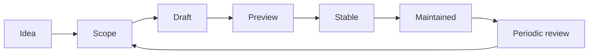

A strong open-source project needs more than code. It needs a clear purpose,
reviewable scope, maintainers, documentation, operations, and a path for future
contributors.

## Lifecycle

## Stages

| Stage | Exit criteria |
| --- | --- |
| Idea | Clear problem, intended users, and benefit. |
| Scope | Boundaries, non-goals, maintainers, and success criteria are written down. |
| Draft | Repository or prototype exists with setup instructions. |
| Preview | Early users can try it and report issues. |
| Stable | Public contract is documented, tested, and versioned. |
| Maintained | Ownership, status, releases, and triage are active. |

## Graduation Checklist

<Steps>
  <Step title="Purpose">
    The project clearly states what it is for and what it will not try to be.
  </Step>
  <Step title="Docs">
    New users can understand, install, run, and contribute without private
    context.
  </Step>
  <Step title="Quality">
    Core behavior is tested or verified, and known limitations are documented.
  </Step>
  <Step title="Operations">
    Public services have status coverage, health checks, and incident paths.
  </Step>
  <Step title="Ownership">
    Maintainers are identified, and review expectations are clear.
  </Step>
</Steps>

<Note>
  Projects can stay small. A focused, maintained tool is better than a large
  project that nobody can confidently continue.
</Note>
