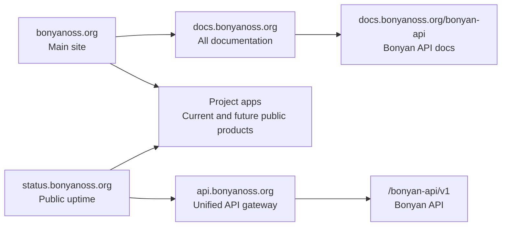

<Frame>
  
  
</Frame>

**BonyanOSS** is a community-driven open-source initiative for building Islamic
and beneficial software: Quran tools, Hadith tools, learning platforms, APIs,
datasets, developer libraries, research utilities, and community infrastructure.

The docs are designed as a long-term developer platform, not a single project
manual. Start from the thing you want to build, then move into the project,
guide, or API reference that matches your work.

<CardGroup cols={3}>
  <Card title="Bonyan API" icon="book-quran" href="/bonyan-api">
    Build Quran, tafsir, recitation, azkar, hadith, prayer-time, Hijri, and
    Qibla workflows on one stable API.
  </Card>
  <Card title="Islamic knowledge APIs" icon="code" href="/reference">
    Use consistent endpoints for Islamic content, with clear envelopes,
    examples, rate limits, and reliability rules.
  </Card>
  <Card title="Open-source projects" icon="diagram-project" href="/projects">
    Understand how BonyanOSS projects are organized, named, documented, and
    grown over time.
  </Card>
</CardGroup>

## Start Here

<CardGroup cols={2}>
  <Card title="Understand the ecosystem" icon="globe" href="/ecosystem">
    The mission, public surfaces, project families, and how everything fits
    together under BonyanOSS.
  </Card>
  <Card title="Make your first API request" icon="rocket" href="/quickstart">
    Call Bonyan API in under a minute using cURL, JavaScript, Python, PHP,
    or Go.
  </Card>
  <Card title="Review the domain map" icon="network-wired" href="/domains">
    See the proposed structure for `bonyanoss.org`, `docs.bonyanoss.org`,
    `api.bonyanoss.org`, project docs, and status pages.
  </Card>
  <Card title="Contribute with confidence" icon="handshake-angle" href="/contributing">
    Learn how to suggest ideas, fix docs, build features, review work, and
    keep projects maintainable.
  </Card>
</CardGroup>

## Platform Shape

## What BonyanOSS Optimizes For

<Steps>
  <Step title="Benefit first">
    Every project should serve a meaningful purpose for Muslims, developers,
    students, researchers, organizations, or the wider community.
  </Step>
  <Step title="Clear contracts">
    APIs, datasets, and libraries should be understandable without private
    context. A new contributor should know what is stable and what may change.
  </Step>
  <Step title="Maintainable by others">
    Code, docs, and infrastructure should be simple enough that future
    contributors can continue the work without rebuilding it from scratch.
  </Step>
  <Step title="Open by default">
    Development should be transparent, welcoming, and documented so the
    community can inspect, improve, and reuse what is built.
  </Step>
</Steps>

## Documentation Areas

| Area | Use it for |
| --- | --- |
| [Home](/) | Orientation, ecosystem map, and high-level routes. |
| [Projects](/projects) | How BonyanOSS groups Quran, Hadith, learning, API, data, and utility projects. |
| [Bonyan API](/bonyan-api) | The first major API surface: Quran, tafsir, reciters, azkar, hadith, prayer, Hijri, and Qibla. |
| [Guides](/guides/design-principles) | Standards for building, documenting, operating, and graduating projects. |
| [Reference](/reference) | Endpoint-level details for the Bonyan API modules. |

<Note>
  BonyanOSS is built around a simple idea: build what benefits people, keep it
  open, and make it easier for others to continue.
</Note>
