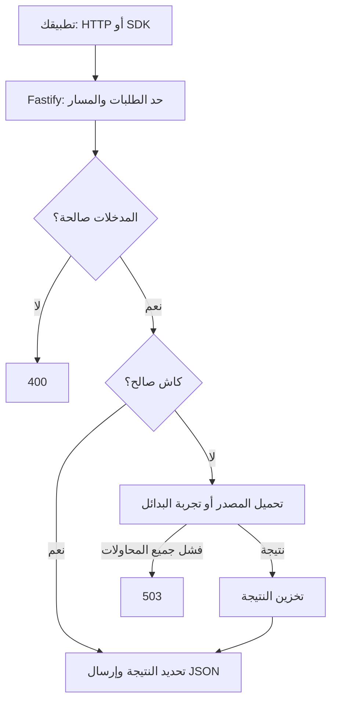

Bonyan API خادم مبني على Fastify. تتحقق وحدات المحتوى التسع من الطلبات، وتجلب البيانات الخارجية، وتخزّن النتائج، وتعيد أشكال JSON الخاصة بكل وحدة. تصف مسارات التشغيل الأربعة حالة العملية نفسها.

## طلب محتوى

يوضح الرسم المسار الشائع. لا تتطابق الوحدات في التحقق من المدخلات أو فحص النتائج الفارغة أو تجربة البدائل. تُقرأ قائمة نسخ التفسير محليًا. يمكن حساب القبلة محليًا. لا تجلب مسارات الصحة محتوى خارجيًا.

## الطبقات

| الطبقة | المسؤولية |
| --- | --- |
| المسارات | مطابقة الرابط واستدعاء المتحكم. |
| المتحكمات | تحليل المدخلات واختيار العناصر وحالة الاستجابة. |
| الخدمات | جلب المصادر وتحويل حقولها إلى أنواع بنيان. |
| الكاش | مشاركة التحميل الجاري وحفظ النتائج الناجحة في الذاكرة. |
| مكتبة العميل | التحقق من بعض المعاملات وإرسال طلبات GET وفك الاستجابة. |

تعمل الخدمة دون قاعدة بيانات. الكاش والمقاييس خاصان بعملية واحدة ويُصفّران عند إعادة تشغيلها. لا تشارك النسخ المتعددة هذه الحالة.

## ما الذي يحافظ عليه البديل؟

يحوّل API بيانات المصادر إلى مجموعة حقول مشتركة. لكن تغيير المصدر قد يغيّر الحقول الاختيارية والمعرّفات والأسماء وعرض النص وتفاصيل حساب الصلاة. اقرأ [سلوك البدائل](/locales/ar/concepts/fallback) قبل الاعتماد على حقل اختياري.
