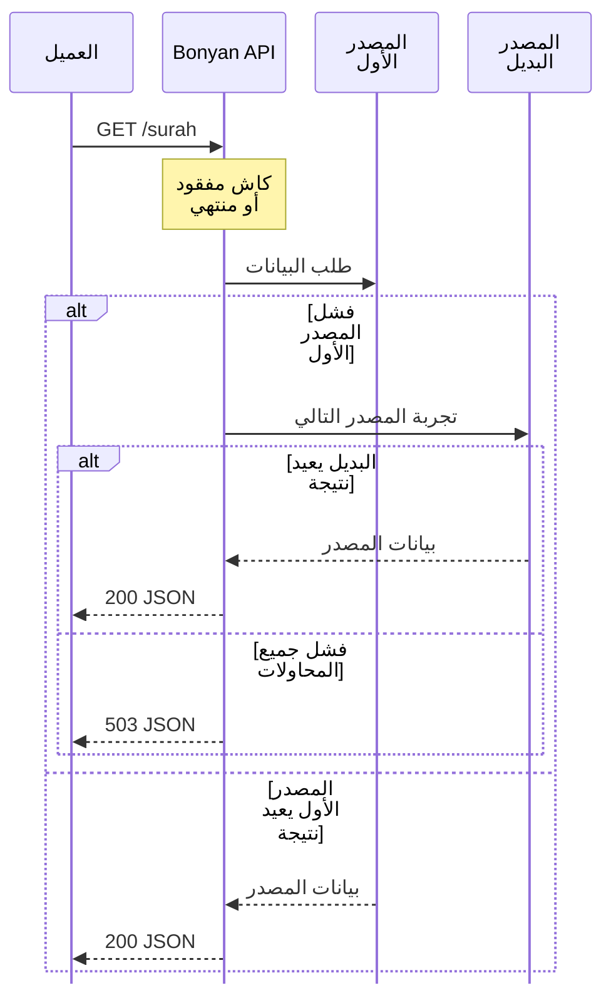

تُجرّب المصادر بالترتيب عند غياب كاش صالح. تجربة البدائل سلوك داخل الخادم، وتختلف عن إعادة المحاولة في SDK.

| الوحدة | ترتيب المصادر وحدودها |
| --- | --- |
| السور | mp3quran.net ثم alquran.cloud ثم quran.com. |
| الآيات | alquran.cloud ثم بيانات fawazahmed0 عبر jsDelivr. |
| القراء | mp3quran.net ثم quran.com. لا يوفر الأخير خوادم صوت المصاحف. |
| التفسير | muyassar: من alquran.cloud ثم quranenc.com. وjalalayn وwaseet وqurtubi: من alquran.cloud فقط. وsaadi: من quranenc.com فقط. |
| الأذكار | نسخة مثبتة من بيانات nawafalqari ثم hisnmuslim.com. |
| الحديث | hadith.gading.dev ثم بيانات sutanlab عبر jsDelivr. |
| الصلاة | إحداثيات Aladhan ثم مدينته إذا أُرسلت، ثم pray.zone للإحداثيات بتاريخ اليوم فقط. |
| الهجري | Aladhan فقط. |
| القبلة | Aladhan ثم حساب محلي على الدائرة العظمى. |

## مثال: غياب كاش السور

تستخدم دالة HTTP المشتركة مهلة 8 ثوانٍ ما لم تُستبدل. تستخدم طلبات القرآن كاملًا 20 ثانية لكل مصدر، وتستخدم الخدمات الأخرى بين 8 و15 ثانية. قد تستغرق المحاولات المتتابعة أكثر من مهلة SDK الافتراضية البالغة 10 ثوانٍ.

لا تعمم التعامل مع النتائج الفارغة. ترفض بعض خدمات الفهارس المصفوفات الفارغة، لكن بعضها يعيد نتيجة فارغة إذا أعادت جميع المصادر فراغًا دون رمي خطأ. يستخدم الحديث والتفسير حلقات خاصة ولا يطبّقان فحص فراغ مشتركًا شاملًا.

## الحقول التي تحتاج فحصًا

استخدم `apiName` لنسب البيانات إلى مصدرها وتشخيص المشاكل. معرّفات القراء خاصة بالمصدر، وقد تغيب بيانات الصوت بعد تبديله. يستخدم `edition` في استجابة التفسير معرّف المصدر. قد يحذف بديل الصلاة الطريقة والإحداثيات ولا يرسل طريقة Aladhan المختارة إلى pray.zone. ثبات شكل JSON لا يضمن تطابق المحتوى أو إعدادات الحساب.
