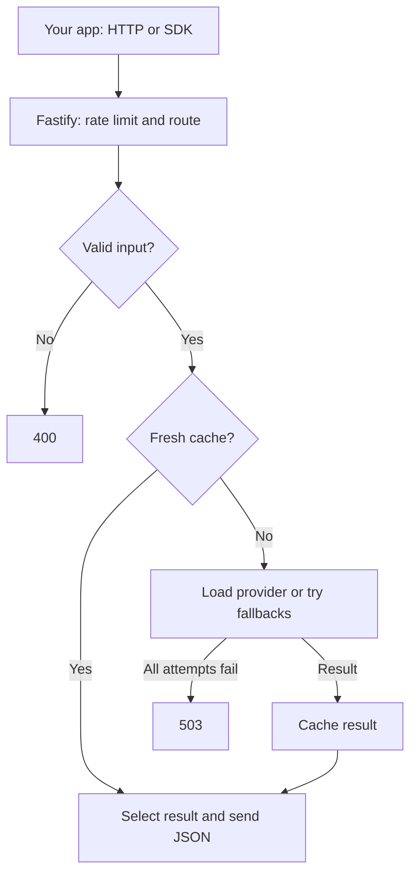

Bonyan API is a Fastify server. Its nine content modules validate requests, fetch external data, cache results and return module-specific JSON shapes. The four operational routes report on the process itself.

## A content request

The diagram shows the common path. Not every module validates inputs, checks empty data or falls back in the same way. Tafsir editions are served from a local catalogue. Qibla can calculate locally. Health endpoints do not load content.

## Layers

| Layer | Responsibility |
| --- | --- |
| Routes | Match URLs and call controllers. |
| Controllers | Parse input, select items and choose response status. |
| Services | Fetch providers and map their fields to Bonyan types. |
| Cache | Share in-flight loads and retain successful results in memory. |
| Client SDK | Validate selected arguments, send GET requests and unwrap responses. |

The service runs without a database. Cache contents and metrics belong to one process and reset when it restarts. Multiple replicas do not share that state.

## What fallback preserves

The API maps provider payloads to a common set of fields. A source change can still affect optional fields, IDs, names, text presentation and prayer calculation details. Read [fallback behavior](/locales/en/concepts/fallback) before depending on an optional field.
