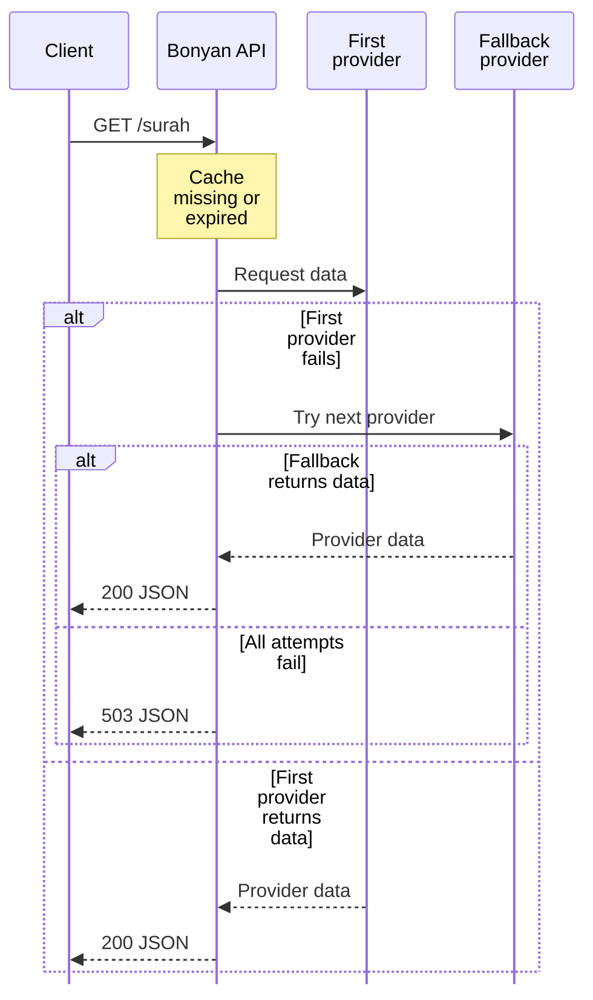

Providers are attempted in order on a cache miss. Fallback is a server-side behavior, separate from SDK retries.

| Module | Source order and limits |
| --- | --- |
| Surah | mp3quran.net, alquran.cloud, quran.com. |
| Ayat | alquran.cloud, then the fawazahmed0 Quran dataset through jsDelivr. |
| Reciters | mp3quran.net, then quran.com. The latter lacks moshaf audio servers. |
| Tafsir | muyassar: alquran.cloud then quranenc.com. jalalayn, waseet and qurtubi: alquran.cloud only. saadi: quranenc.com only. |
| Azkar | Pinned nawafalqari dataset, then hisnmuslim.com. |
| Hadith | hadith.gading.dev, then sutanlab dataset through jsDelivr. |
| Prayer | Aladhan coordinates, Aladhan city if supplied, then pray.zone only for coordinates dated today. |
| Hijri | Aladhan only. |
| Qibla | Aladhan, then local great-circle calculation. |

## Example: a surah cache miss

The shared HTTP helper uses an 8-second timeout unless overridden. Full-Quran requests use 20 seconds per source; other services use 8..15 seconds. Multiple attempts can outlast the SDK's 10-second default.

Do not generalize empty-result handling. Several catalogue services reject empty arrays, but some return an empty result if all providers return empty without throwing. Hadith and tafsir use their own loops and do not apply a universal shared emptiness test.

## Fields to inspect

Use `apiName` for source attribution and diagnostics. Reciter IDs are source-specific; audio metadata can disappear after a source switch. Tafsir `edition` uses provider identifiers in responses. Prayer fallback can omit method/coordinates and does not forward the chosen Aladhan method to pray.zone. A fixed JSON shape does not guarantee identical content or calculation settings.
